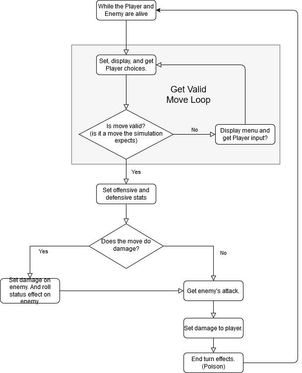

# KnumberKnights
Console based dungeon crawler.


# Tasks
## Priority:
### 1. Basic Combat ( In Progress )
One weapon, two off hand options, magic options.  
When playing you only have one enemy (skelyguy).  
One potion to use. 

```diff
TODO:
+ Set Up Basic Combat Options ( Complete )
+ Spawn Enemy ( Complete )
+ Have A Complete Combat Loop ( Complete )
# Set Up Enemy Type
- Dynamic Difficulty ( Needs Improvement )
+ Get Player Input Loop ( Complete )
! Create Multiple Weapon Slots ( In Progress )
! Create Player Inventory ( In Progress )
# Allow switching of weapons
# Implement Magic
- Balance Basic Combat ( Needs Improvement )
! Create Functional Display for Combat ( In Progress )
# Create Display for Menu: Inventory, In-Game, Lobby
```



A little menu, switch weapons from offhand (shield, sword, dagger).  
10 options, this restriction comes from 0-9 on the number (knumber) pad:
  1. Light Attack
  2. Heavy Attack
  3. Block
  4. Light Magic
  5. Heavy Magic
  6. Special Magic
  7. Use Item
  8. Escape
  9. Open Inventory
  0. In-Game Menu

### 2. Advanced Combat
### 3. Multiple Levels
## Preffered:
4. Dungeons
5. Exploration
## Optional:
6. Open World (TBD)
7. Storyline (TBD)

## Inspiration:
[Stone Story](https://store.steampowered.com/app/603390/Stone_Story_RPG/)  
The Legend of Zelda
